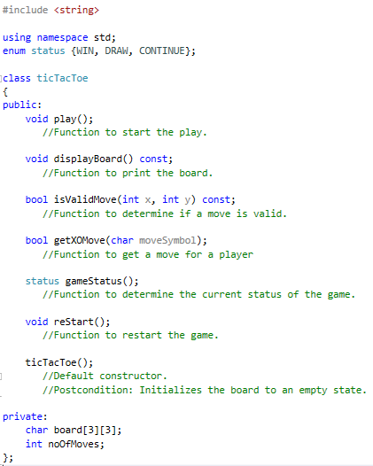
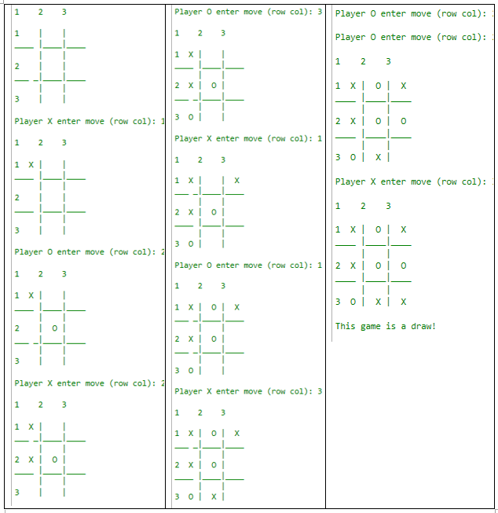

# Tic-Tac-Toe Program (Assignment 1)

## Objectives

Apply Software Engineering design and implementation concept and object class:
Tic-Tac-Toe program

## Description

Write a program that allows two players (X and O) to play the tic-tac-toe game
on a 3 by 3 two-dimensional array board.  Some of the operations on a
ticTacToe object are printing the current board, getting a move, checking if a
move is valid and determining the winner after each move.  Add additional
operations as needed.  You are giving the TicTacToe.h header file with the
ticTacToe class as follows:

TicTacToe.h header file | Sample Output
----------------------- | -------------
 | 

## Requirements

- `cmake` >= 3.10
- C++ 11

## Building and Running

To build out-of-source, run the following commands:

1. `mkdir build && cd build`
2. `cmake ..`
3. `make`

To run the tests, run the following command

- `./tictactoetest`

and to run the main program, run the following command

- `./tictactoemain`
