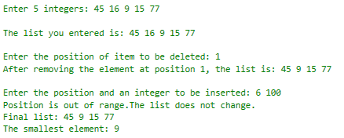
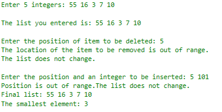
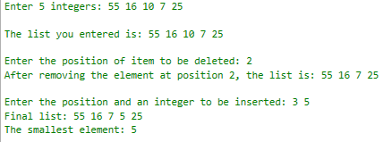

# Array-based List Program (Assignment 2)

## Objectives

Insert and delete an item of an unsorted array list.

## Description

1. Your primary tasks for this exercise are to complete the header file by
writing the definition of four functions with its description below:

- `removeAt` function – to remove the item from the list at the position
specified by location.  Because the list elements are in no particular order
(unsorted list), you could simply remove the element by swapping the last
element of the list with the item to be removed and reducing the length of the
list.

- `insertAt` function - to insert an item in the list at the position specified
by location.  The item to be inserted is passed as a parameter to the function.

- `print` function – to output the elements of the list.

- `min` function – to output the smallest element of the list

2. And demonstrate the class `arrayListType` by write the main program (cpp)
tha tasks a user to enter 5 integers. After displaying the entered 5 integers,
ask the user the position of the item to be deleted and inserted.  Your program
should include error checking if the position is out of range or array is full,
display the final list of array and find the minimum value.

Sample Output 1 | Sample Output 2 | Sample Output 3
----------------------- | ------------- | -----------
 |  | 

## Requirements

- `cmake` >= 3.10
- C++ 11

## Building and Running

To build out-of-source, run the following commands:

1. `mkdir build && cd build`
2. `cmake ..`
3. `make`

To run the tests, run the following command

- `./tests`

and to run the main program, run the following command

- `./main`
